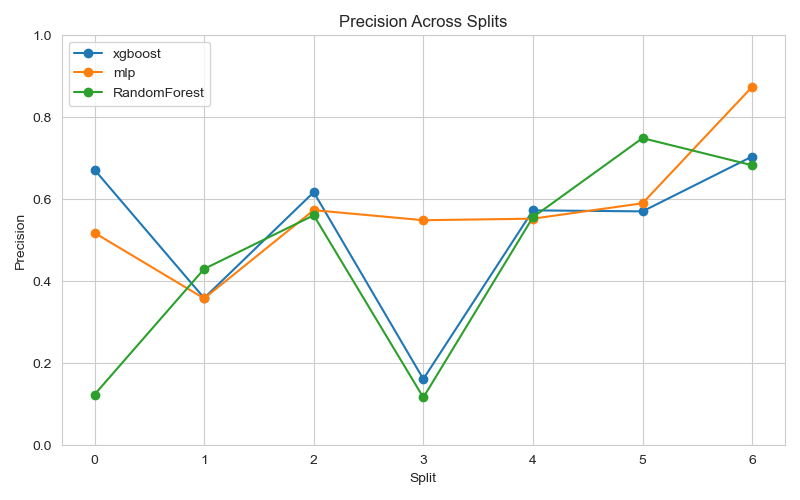
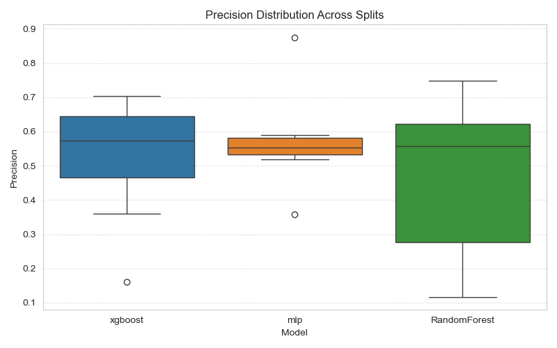
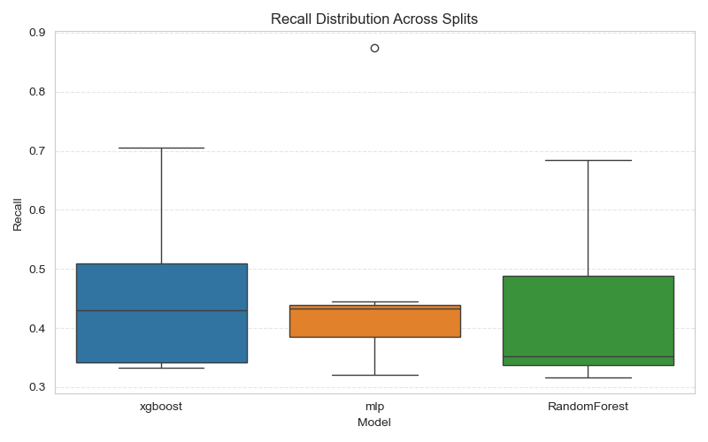
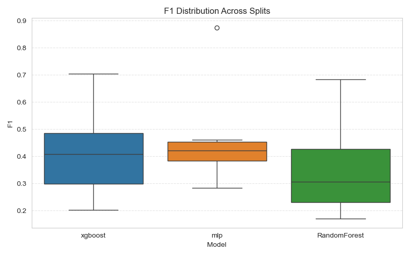
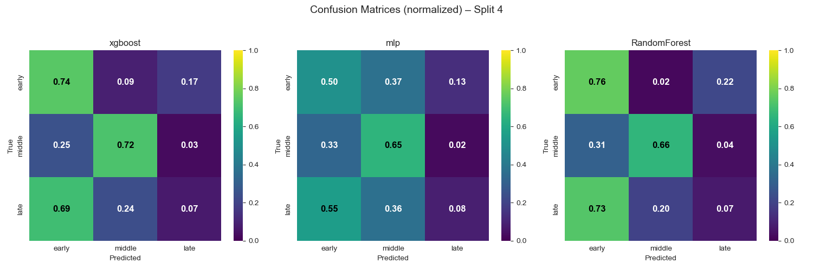

# Model Evaluation Report

_Generated: 2025-08-04 20:50_

---

## Summary (Mean ± Std across Splits)

| Model        | Accuracy      | Precision     | Recall        | F1            |
|:-------------|:--------------|:--------------|:--------------|:--------------|
| RandomForest | 0.429 ± 0.143 | 0.460 ± 0.253 | 0.429 ± 0.143 | 0.353 ± 0.178 |
| mlp          | 0.468 ± 0.184 | 0.574 ± 0.153 | 0.468 ± 0.184 | 0.465 ± 0.190 |
| xgboost      | 0.453 ± 0.140 | 0.523 ± 0.194 | 0.453 ± 0.140 | 0.412 ± 0.169 |

## Radar Plots

## Per-Split Metrics

**Accuracy per Split**

|   Split |   RandomForest |      mlp |   xgboost |
|--------:|---------------:|---------:|----------:|
|       0 |       0.351852 | 0.388889 |  0.444444 |
|       1 |       0.337553 | 0.320675 |  0.333333 |
|       2 |       0.336806 | 0.434028 |  0.333333 |
|       3 |       0.316667 | 0.433333 |  0.35     |
|       4 |       0.403471 | 0.381779 |  0.429501 |
|       5 |       0.574074 | 0.444444 |  0.574074 |
|       6 |       0.683983 | 0.874459 |  0.705628 |

**Precision per Split**

|   Split |   RandomForest |      mlp |   xgboost |
|--------:|---------------:|---------:|----------:|
|       0 |       0.1238   | 0.518258 |  0.672222 |
|       1 |       0.430292 | 0.358351 |  0.359253 |
|       2 |       0.561161 | 0.57373  |  0.617491 |
|       3 |       0.116667 | 0.549116 |  0.161696 |
|       4 |       0.556455 | 0.552926 |  0.573175 |
|       5 |       0.749427 | 0.590494 |  0.570722 |
|       6 |       0.683259 | 0.874418 |  0.704533 |

**Recall per Split**

|   Split |   RandomForest |      mlp |   xgboost |
|--------:|---------------:|---------:|----------:|
|       0 |       0.351852 | 0.388889 |  0.444444 |
|       1 |       0.337553 | 0.320675 |  0.333333 |
|       2 |       0.336806 | 0.434028 |  0.333333 |
|       3 |       0.316667 | 0.433333 |  0.35     |
|       4 |       0.403471 | 0.381779 |  0.429501 |
|       5 |       0.574074 | 0.444444 |  0.574074 |
|       6 |       0.683983 | 0.874459 |  0.705628 |

**F1 per Split**

|   Split |   RandomForest |      mlp |   xgboost |
|--------:|---------------:|---------:|----------:|
|       0 |       0.183156 | 0.402792 |  0.439153 |
|       1 |       0.278765 | 0.283051 |  0.27657  |
|       2 |       0.306308 | 0.446296 |  0.3191   |
|       3 |       0.170513 | 0.421262 |  0.202821 |
|       4 |       0.396326 | 0.365399 |  0.408172 |
|       5 |       0.45641  | 0.461137 |  0.532597 |
|       6 |       0.682773 | 0.874416 |  0.704156 |

## Confusion Matrices per Split

### Confusion Matrices Split 0

### Confusion Matrices Split 1

### Confusion Matrices Split 2

### Confusion Matrices Split 3

### Confusion Matrices Split 4

### Confusion Matrices Split 5

### Confusion Matrices Split 6

