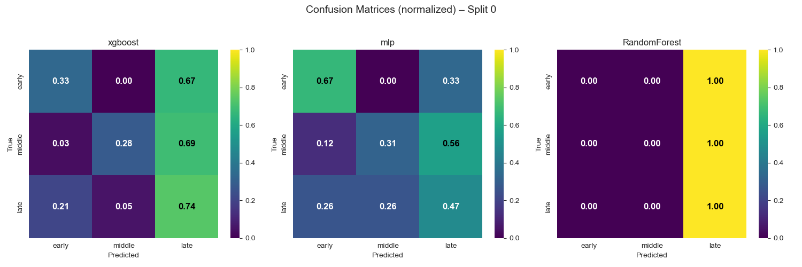
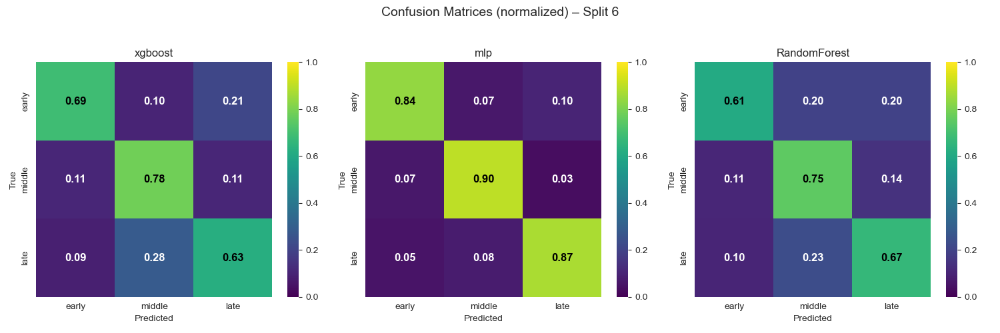

# Phage Classification – Model Comparison Report

_Generated: 2025-08-02 19:55_

---

## Overview

This report compares **XGBoost**, **MLP**, and **RandomForest** over LOGO splits (0–5) and a stratified split (6). Metrics include **Accuracy**, **Precision**, **Recall**, and **F1**.

## Summary (Mean ± Std across Splits)

| Model        | Accuracy      | Precision     | Recall        | F1            |
|:-------------|:--------------|:--------------|:--------------|:--------------|
| RandomForest | 0.475 ± 0.123 | 0.479 ± 0.149 | 0.475 ± 0.123 | 0.423 ± 0.177 |
| mlp          | 0.466 ± 0.103 | 0.453 ± 0.121 | 0.466 ± 0.103 | 0.439 ± 0.125 |
| xgboost      | 0.486 ± 0.107 | 0.510 ± 0.139 | 0.486 ± 0.107 | 0.446 ± 0.153 |

## Metrics Across Splits (Line Charts)

## Metrics Distribution (Box Plots)

## Radar Plot (Mean Across Splits)

## Per-Split Metrics (Tables)

**Accuracy per Split**

|   Split |   RandomForest |      mlp |   xgboost |
|--------:|---------------:|---------:|----------:|
|       0 |       0.351852 | 0.481481 |  0.351852 |
|       1 |       0.324895 | 0.291139 |  0.337553 |
|       2 |       0.59375  | 0.548611 |  0.569444 |
|       3 |       0.366667 | 0.35     |  0.45     |
|       4 |       0.56833  | 0.522777 |  0.555315 |
|       5 |       0.518519 | 0.537037 |  0.537037 |
|       6 |       0.601732 | 0.532468 |  0.597403 |

**Precision per Split**

|   Split |   RandomForest |      mlp |   xgboost |
|--------:|---------------:|---------:|----------:|
|       0 |       0.418091 | 0.48333  |  0.422963 |
|       1 |       0.223434 | 0.214685 |  0.236512 |
|       2 |       0.636166 | 0.546947 |  0.603208 |
|       3 |       0.368868 | 0.367647 |  0.522421 |
|       4 |       0.540808 | 0.509736 |  0.558414 |
|       5 |       0.543447 | 0.519833 |  0.614552 |
|       6 |       0.61949  | 0.530443 |  0.614601 |

**Recall per Split**

|   Split |   RandomForest |      mlp |   xgboost |
|--------:|---------------:|---------:|----------:|
|       0 |       0.351852 | 0.481481 |  0.351852 |
|       1 |       0.324895 | 0.291139 |  0.337553 |
|       2 |       0.59375  | 0.548611 |  0.569444 |
|       3 |       0.366667 | 0.35     |  0.45     |
|       4 |       0.56833  | 0.522777 |  0.555315 |
|       5 |       0.518519 | 0.537037 |  0.537037 |
|       6 |       0.601732 | 0.532468 |  0.597403 |

**F1 per Split**

|   Split |   RandomForest |      mlp |   xgboost |
|--------:|---------------:|---------:|----------:|
|       0 |       0.213262 | 0.481956 |  0.218433 |
|       1 |       0.238048 | 0.204001 |  0.250037 |
|       2 |       0.612584 | 0.547264 |  0.584944 |
|       3 |       0.2699   | 0.325816 |  0.451033 |
|       4 |       0.552918 | 0.492773 |  0.535427 |
|       5 |       0.483849 | 0.512983 |  0.496069 |
|       6 |       0.593456 | 0.505167 |  0.586179 |

## Confusion Matrices (Normalized, per Split)

### confusion_matrices_split_0

### confusion_matrices_split_1

### confusion_matrices_split_2

### confusion_matrices_split_3

### confusion_matrices_split_4

### confusion_matrices_split_5

### confusion_matrices_split_6

---

## Files

- `metrics_all_splits.csv` — raw metrics per model/split

- `metrics_lines_*.png`, `metrics_boxplot_*.png`, `metrics_radar.png` — summary figures

- `confusion_matrices_split_*.png` — per-split confusion matrix grids
