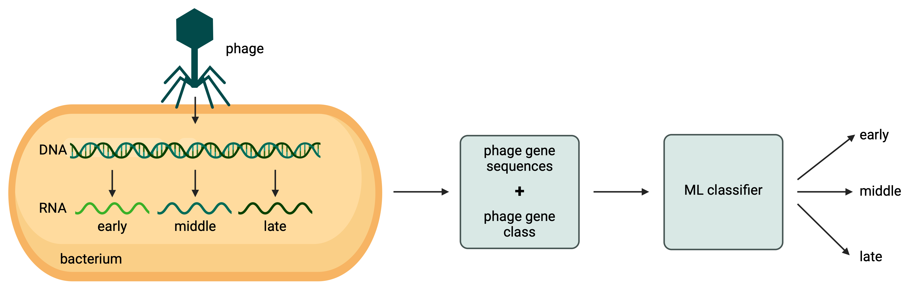
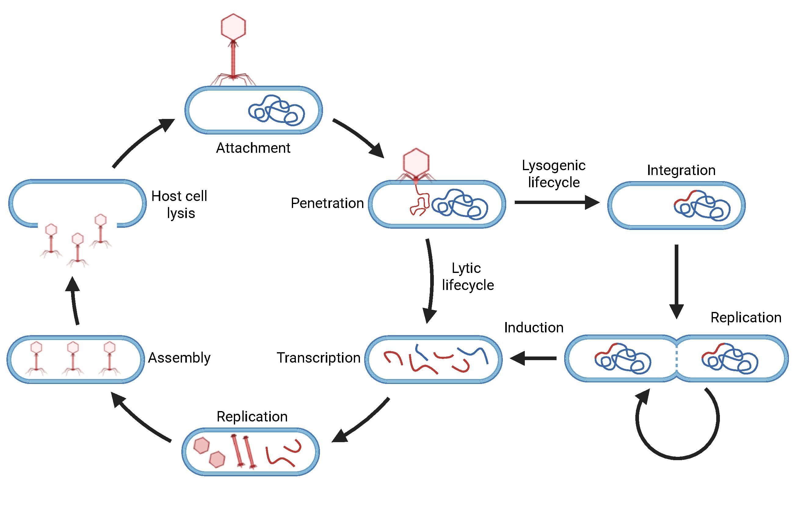

<h1> Phage Infection Classifier</h1>

## Introduction

### Summary
The goal of this project was to develop machine learning models capable of classifying phage genes into the **early**, **middle**, and **late** stages of infection.  
Classification of phage genes into infection stages enables a deeper understanding of phage-host interactions and provides insights into the timing and regulation of gene expression during infection. Furthermore, this classification narrows down potential functions for a given gene, aiding in the annotation of phage genomes.
This project showcases a machine learning-based approach for automated gene classification, which can accelerate phage genome annotation and reduce reliance on labor-intensive experimental methods.

To achieve this, transcriptomic data from dual sequencing experiments was preprocessed, normalized, and filtered. This data contained expression levels for phage and host genes throughout the infection process. Phage genes were manually classified into early, middle, and late categories based on various factors [link to section that explains this].  
Three different machine learning models were selected to increase variety and improve the chances of success. To train the models effectively, a range of features derived from gene and protein sequences, as well as external factors, were selected as inputs. Finally, the models were evaluated and hyper-parameter tuning was performed to optimize classification performance. The final models and their performance are presented in [results section].

<figure>
    
    <figcaption>Figure 1: Workflow Summary</figcaption>
</figure>

### Phages
Bacteriophages (phages for short) are viruses that infect bacteria. They represent the most abundant biological entities on Earth, with an estimated total count of 10³¹, one order of magnitude more abundant than bacteria. Given this prominence, they play a vital role in shaping ecosystems, ranging from soils to aqueous ecosystems and the human microbiome. Phages regulate bacterial populations and are also key drivers of bacterial co-evolution. Due to their host specificity, phages hold great potential in biotechnology and medicine. One such application, known as **phage therapy**, involves using phages as an alternative to antibiotics, to combat the threat of antibiotic-resistant bacteria.

#### Phage Infection Cycle
Phages generally follow two main lifecycles: **lytic** and **lysogenic**. **Temperate phages** may enter either, while **virulent phages** only use the lytic cycle.
A typical infection cycle, as an example the virulent model phage T4 infecting *E.coli*, goes as follows: 
T4 attaches to the surface of the host cell using tail fibers, and injects its DNA into the host. The phage DNA immediately starts takeover of the host replication machinery to transcribe **early genes**. Theses genes produce proteins that help with phage transcription, and counteract bacterial anti-defence systems. Next, a switch to **middle genes** is made, which are generally involved in phage DNA replication, ensuring efficient genome reduplication. Finally, a set of **late genes** encode structural proteins used to encapsulate the phage’s genome and construct the phage body. Infection ends with the lysis of the host cell releasing around 100 to 150 phage particles to continue the cycle.

The lysogenic lifecycle allows temperate phages to co-replicate with the bacterial host, by integrating into the host's genome as so called prophages. They may enter the lytic cycle due to external stressors, such as DNA damage.

<figure>
    
    <figcaption>Figure 2: Phage infection cycle. Created in https://BioRender.com</figcaption>
</figure>

#### Gene Classification
Classifying phage genes into early, middle, and late infection stages is advantageous for understanding phage biology and their interactions with bacterial hosts. It can also aid in the development of phage therapy applications by identifying which genes are involved in specific stages of infection. Furthermore, from these classfications, hypotheses for potential gene functions can be made, offering candidates for experimental validation.

However, such classification is rare in public datasets, as it requires multiple sequencing runs and represents a large, time-intensive effort.  
These studies are typically performed as **dual sequencing (dual-seq)** experiments, where both host and phage transcriptomes are jointly analysed throughout infection. Both host and phage RNA are sequenced at set time intervals, showing the level of expression for each respective gene throughout the infection.  
Phage genes can be classified into early, middle and late stages, based on the expression level for each gene, at a certain time point. This can be different for each phage, as infection-cycle durations can last anywhere from 15 minutes to over an hour.

#### Machine Learning Models
Machine learning (ML) models are algorithms that learn patterns from data to make predictions or decisions without being explicitly programmed for each task. In supervised learning, models are trained on labeled examples, in this case phage genes labeled as early, middle, or late, to learn the patterns that distinguish each class.

The training process involves feeding the model input data (features) along with the correct output labels. The model then iteratively adjusts its internal parameters to minimize the difference between its predictions and the actual labels, a process guided by an optimization algorithm. Once trained, the model can hopefully generalize what it has learned to new, unseen data, making predictions based on the patterns it has identified.

This approach is advantageous because it can uncover complex, non-linear relationships in the data that may not be easily identifiable through manual analysis. In biological systems, where multiple interacting factors influence gene expression, this ability to model subtle dependencies is particularly valuable.